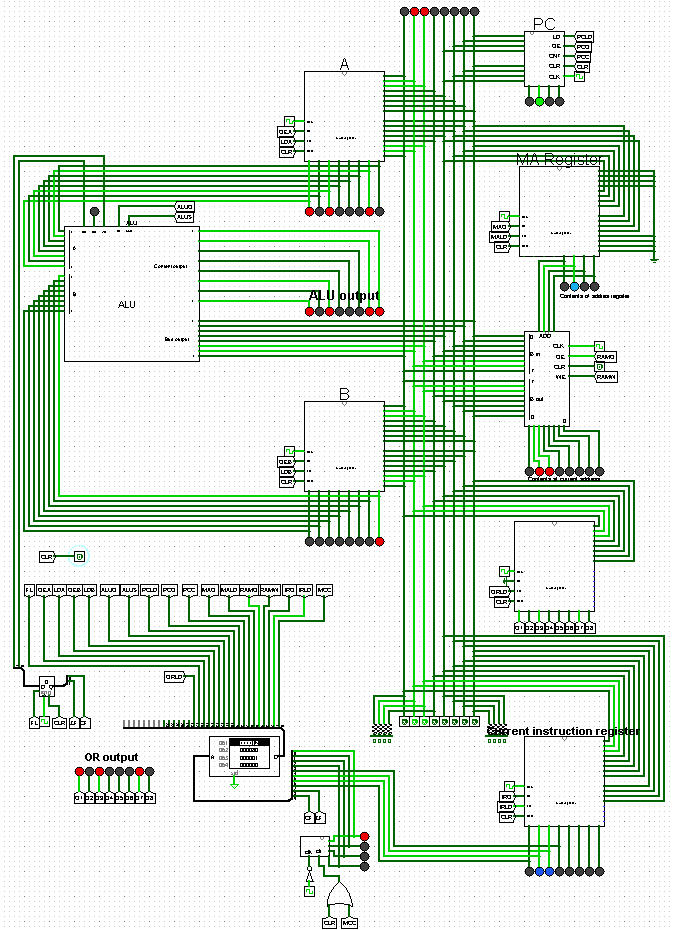

# Embedded systems final assignment.
This repository is the repository for my final assignment for the module embedded systems that is part of the minor Smart Embedded systems.
## Introduction. 
I recently watched a series of videos on youtube about building your own 8-bit CPU on breadboards. It was really interesting watching the videos and really learning how a CPU in essence works. The videos are by [Ben Eater](https://eater.net/8bit). Building the CPU myself on breadboard seemed a little costly and ambitious. I decided I want to remake the CPU in vhdl as a final assignment for Embedded System.

The CPU contains an ALU that can add and subtract. Connected to the ALU are the A and B registers. There also is an output register as a general purpose register. An instruction register is used to hold the current instruction being ran by the CPU. RAM is used to store the program and store variables. In order to control the ram a memory addres register (MAR) is used. The RAM itself is created by an Altera IP specifiic to the FPGA on the DE0-Nano.

The decoding of the instructions is done using combinational logic. The first 4 bits of the instruction describes the function of the instruction and the last 4 bits are used to give a value to an instruction. With this system, 16 different instructions are supported. In order to make conditional jumping in the CPU's program possible, a flags register containing a zero flag and carry flag is used.

The goal is to be able to completely simulate the CPU and, if possible, make it run on a DE10-nano or DE0-nano board. I will try to make the CPU in the same order as the video series on Youtube. In this repository I will describe my findings and place the VHDL code.

I will try to remake the system as much the same as Ben Eaters system. There can be some changes in naming and logic because it makes more sense to me or is easier to implement in VHDL.

## Orientation. 🖥️
After watchin the video series, I first started implementing the CPU in Logisim. Logisim is a program that can simulatie digital circuits. I made modules for each of the systems in the CPU and then combined them together to form the complete CPU. Using logisim, I will first describe each module.

This is the complete CPU implemented in logisim. In the center is the 8 bits memory bus which connects all modules together. On the right side of the bus is the program counter, memory address register, RAM, output register and instruction register. On the left side are the A and B registers which are connected to the ALU. On the left is also the control logic of the CPU which controls the control lines of all modules based on the current instruction register, the microcounter and the flags register. The flags register saves the Zero out and carry out flag of the ALU after an addition or subtraction instruction.

### Instuctions

The program's instructions are saved of the RAM of the CPU. An instruction can have a max of 16 micro-operations, this is because the microcounter is a 4 bits counter. 

The control lines that are driven by the control logic are connected to the individual modules. 

All instructions:
| instruction | description                 | 0           | 1            | 2           | 3                         | 4           | 5   |
|-------------|-----------------------------|-------------|--------------|-------------|---------------------------|-------------|-----|
| NOOP        | Does nothing                | PCO \| MALD | RAMO \| IRLD | PCC         | MCC                       |             |     |
| LDA         | Load from ram to A          | PCO \| MALD | RAMO \| IRLD | PCC         | IRO \| MALD               | RAMO \| LDA | MCC |
| LDB         | load from ram to B          | PCC \| MALD | RAMO \| IRLD | PCC         | IRO \| MALD               | RAMO \| LDB | MCC |
| ADD         | Put A+B in A                | PCO \| MALD | RAMO \| IRLD | PCC         | ALUO \| FL \|LDA          | MCC         |     |
| JMP         | Jump in ram                 | PCO \| MALD | RAMO \| IRLD | IRO \| PCLD | MCC                       |             |     |
| SUB         | Put A-B in A                | PCO \| MALD | RAMO \| IRLD | PCC         | ALUS \| ALUO \| FL \| LDA | MCC         |     |
| JMPZ        | Jump in ram when ZF == 0    | PCO \| MALD | RAMO \| IRLD | PCC         | MCC                       |             |     |
| JMPZ        | Jump in ram when ZF == 1    | PCO \| MALD | RAMO \| IRLD | IRO \| PCLD | MCC                       |             |     |
| ORLA        | Load A into output register | PCO \| MALD | RAMO \| IRLD | PCC         | OEA \| ORLD               | MCC         |     |

## VHDL implementation

After the logisim simulation was behaving as expected I moved to the VHDL implementation. I created a fresh quartus project and implemented all modules seperately. Every module is simulated to test its behaviour. Also a visual inspection was done for eacht module using the RTL viewer in Quartus.

After all the modules were complete all modules were connected to their control signals inthe top level entity and the control logic was implemented. The contro logic is also done in the top level entity. After simulation and a visual inspection, the project was programmed onto a DE0 nano baord with the buttons as a clock and reset. Later the clock on the DE0 board was used. 
